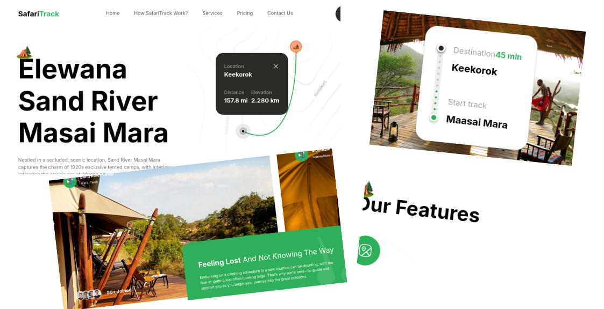

# SafariTrack Landing Page

  

Welcome to **SafariTrack**, your ultimate travel companion. Built with **Next.js**, **TailwindCSS**, and **TypeScript**, this landing page showcases the beauty of Kenya while providing a seamless user experience.

## ⚙️ Tech Stack

- **Next.js**
- **TailwindCSS**
- **TypeScript**

## 🔋 Features

- **Appealing Hero Section**: Visually striking hero section that captures attention and sets the tone for the website.
- **Camp Exploration Section**: Showcase various camps in a dedicated section, allowing users to explore different options.
- **Engaging Travel Guide Section**: A compelling travel guide section with informative content and captivating visuals.
- **Feature-Rich Section**: A complex and feature-rich section offering advanced functionalities or in-depth information.
- **Call to Action for Mobile Apps**: A call-to-action section encouraging users to explore the mobile app version, complete with download links.
- **Footer**: Comprehensive footer section containing site and social media links for easy navigation and connectivity.


## 🤸 Quick Start

Follow these steps to set up the project locally on your machine.


### Cloning the Repository

1. Clone the repository:
   ```bash
   git clone https://github.com/MuxN4/safari_track.git
   ```

2. Navigate into the project directory:
    ```bash
    cd safari_track
    ```

3. Installation
Install the project dependencies using npm:

    ```bash
    npm install
    ```

1. Running the Project
Run the development server:

    ```bash
    npm run dev
    ```

Open your browser and navigate to `http://localhost:3000` to view the project.

